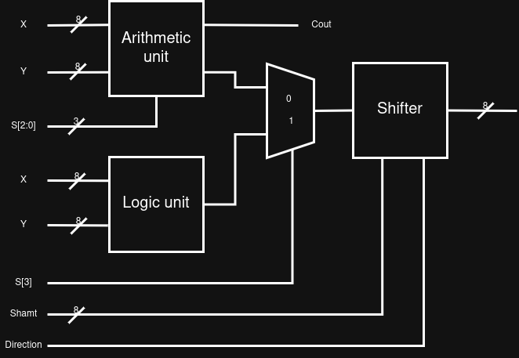
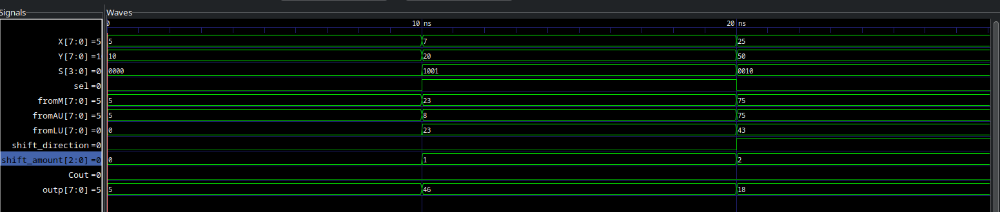

# 8-BIT ADDER-SHIFTER ALU


## TABLE OF CONTENTS
- [Overview](#overview)
- [How it works](#how_it_works)
- [Screenshot](#screenshot)
- [Built with](#built_with)
- [Compilation instructions](#compilation_instruction)

## OVERVIEW
The adder-shifter ALU consists of three units: The arithmetic unit, the logic unit and a shifter, the results from the arithmetic and logic units are multiplexed and the outcome sent to a shifter that shifts the results some amount of times to the right or left based on user inputs

The arithmetic performs 7 operations based on the select signals whereas the logic units perform 4 logic operations

## HOW IT WORKS
The table below shows the operations the ALU performs 

| S<sub>3</sub> | S<sub>s</sub> | S<sub>1</sub> | S<sub>0</sub> | Operation |
|-----------|--------|---------|-----------|----------|
| 0 | 0 | 0 | 0 | G = X |
| 0 | 0 | 0 | 1 | G = X + 1 |
| 0 | 0 | 1 | 0 | G = X + Y|
| 0 | 0 | 1 | 1 | G = X + Y + 1|
| 0 | 1 | 0 | 0 | G = X + Y'|
| 0 | 1 | 0 | 1 | G = X + Y' + 1 |
| 0 | 1 | 1 | 0 | G = X - 1 |
| 0 | 1 | 1 | 1 | G = X |
| 1 | x | 0 | 0 | G = X and Y|
| 1 | x | 0 | 1 | G = X or Y |
| 1 | x | 1 | 0 | G = X xor Y |
| 1 | x | 1 | 1 | G = X' |

from the table, we were able to  design the ALU's arithmetic units and logic units

## SCREENSHOTS
### HARDWARE DESIGN

- Hardware design


- Arithmetic unit


- Logic unit


### SIMULATION RESULTS
- Simulation results


### BUILT WITH
    - The whole project was implemented using Verilog, iverilog simulator and the gtkwave waveform viewer

### COMPILATION INSTRUCTION
To run the code, 
- First download this repo
- Then on your system with iverilog and gtkwave installed, run
```
  make
  gtkwave top.vcd
```